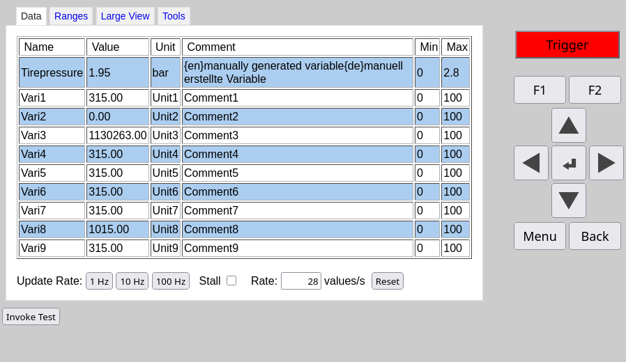
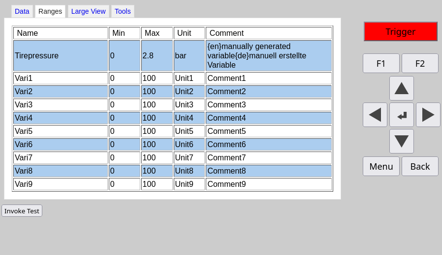
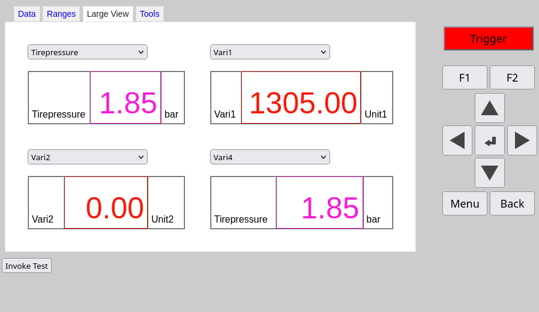
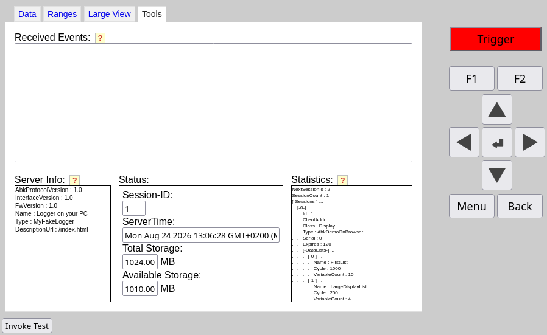

 
## Open Logger-to-Display Communication Standard

**libABK** is a C++ reference implementation of the [**openABK**](https://openabk.org/) standard. It's being used productively to power displays and loggers, to ensure smooth interoperation during live measurement data related visualization workloads.

It consists out of three major modules, which can be used accordingly.

## Features
libABK provides the tools to quickly implement an openABK client or a server.

A server is usually a device acquiring measurement data, such as a logger.
A client is usually a device for displaying parts of the acquired measurement data.

* **Flexible Server:** A server backend taking care of managing data objects, such as variables shared between devices.
* **Soup-based Client:** A client using [Soup 3.0](https://libsoup.gnome.org/libsoup-3.0/index.html)
* **Browser-based Client:** A client, that uses JavaScript to demonstrate, that the protocol is capable of working within a browser.

| Exchange of measurement data | Inform about expected ranges |
|----|----|
|  |  |

| Live Data | Client and Server Information |
|----|----|
|  |  |
| Obtain live data from the logger (server) | Exchange client and server information |

## Dependencies
* [CMake](https://cmake.org/) >= 3.25
* [C++17](https://en.cppreference.com/w/cpp/17) compatible compiler
* [Boost](https://www.boost.org/) >= 1.78.0

### Server (Drogon-based)
* [Drogon](https://github.com/drogonframework/drogon) >= 1.8.7
* [JsonCpp](https://github.com/open-source-parsers/jsoncpp) >= 1.9.5

### Client
* [libsoup](https://libsoup.org/) >= 3.0

## Flexible Server
This code resides in ServerExample and contains a base class that can be sub-classed,
to connect to the own code base or C++ HTTP framework.

Integration with Drogon and an in-memory C++ mock framework are provided,
to assist with faster integration.

## Soup-based Client
This code provides an implementation of a client library, based on the Soup HTTP client library.
It's designed to be running on Linux-based systems, without creating any friction.
See the [ClientBoost](ClientBoost) folder for building and usage instructions.

## Browser-based Client
Although this code isn't being used productively, it demonstrates the capability of running a client inside the
limitations of a browser. It needs to be hosted on the same port as the ABK server.

## Unmaintained Implementations
The client library code, contains an ATL-based implementation (for Windows).
It's not actively maintained or tested and provided only for reference.
The only actively maintained implementation is the Soup-based client library.

## Build instruction
In order to build the library, you need to have the dependencies installed.
To achieve this on Ubuntu 24.04, you can run the following commands:

```bash
sudo apt update
sudo apt-get install -y build-essential cmake libboost-all-dev libsoup-3.0-dev libjsoncpp-dev ninja-build
```

Checkout the repository:

```bash
git clone https://github.com/openABK/libABK.git
cd libABK
```

And build the server example (this will download and build Drogon and its dependencies):

```bash
cmake -B build -G Ninja -DBUILD_TESTS=ON -DCMAKE_BUILD_TYPE=RelWithDebInfo -DABK_ALLOW_FETCH_CONTENT=ON -DBUILD_EXAMPLES=OFF -DBUILD_CTL=OFF
cmake --build build --target ServerExample
```

After a successful build, the path to the server example executable will be `build/ServerExample/ServerExample`.

In order to build the client test, you can run the following command:

```bash
cmake --build build --target TestABK
```

This test will attempt to connect to a running server and do basic checks to ensure,
that the client code is working as expected.

To use this project in your own CMake project, you can add it as a subdirectory and add
"ServerLib" or "LibAbkClient" to your target link libraries,
which will also automatically add the include directories to your target.

Feel free to reference the Client test or the Server example for usage examples.

## Licensing
libABK is licensed under the **MIT License**. See the accompanying [LICENSE](LICENSE) file, for the full text.
Please note, that "Simple Tabs" is licensed under the **GPLv2 License**,
which is used as a component for the browser-based client, making the combined work (browser-based client) subject to the terms of the GPLv2 license.